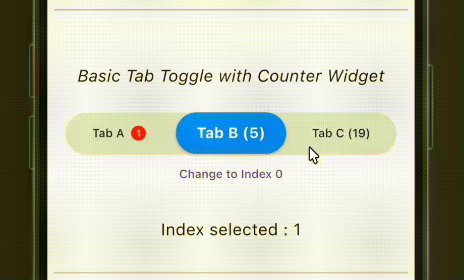
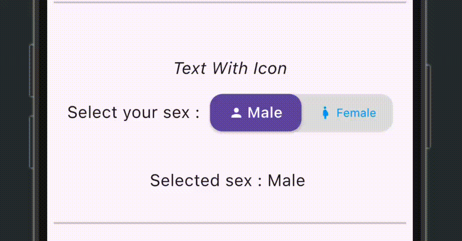
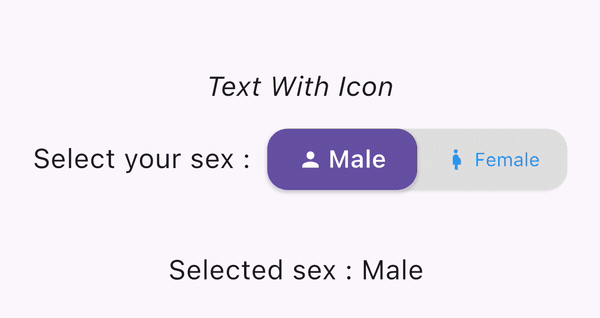

# Flutter Toggle Tab

[](https://pub.dev/packages/flutter_toggle_tab)

A controlled, responsive toggle-tab widget for Flutter. It supports text,
icons, counter widgets, equal or adaptive widths, gradients, custom text
styles, margins, shadows, and animated selection.


## Requirements

- Flutter 3.47 or newer
- Dart 3.13 or newer
- `material_ui` 1.3 or newer

Version 2.0 uses Flutter's standalone Material package. Applications using
legacy `package:flutter/material.dart` imports should complete the Flutter 3.47
Material migration before upgrading this package.

## Installation

Add the package and the standalone Material package:

```sh
flutter pub add flutter_toggle_tab material_ui
```

Then import both packages where they are used:

```dart
import 'package:flutter_toggle_tab/flutter_toggle_tab.dart';
import 'package:material_ui/material_ui.dart';
```

## Basic usage

`FlutterToggleTab` is controlled by `selectedIndex`. Update that value whenever
`selectedLabelIndex` is called.

```dart
class CategoryToggle extends StatefulWidget {
  const CategoryToggle({super.key});

  @override
  State<CategoryToggle> createState() => _CategoryToggleState();
}

class _CategoryToggleState extends State<CategoryToggle> {
  int selectedIndex = 0;

  final tabs = [
    DataTab(title: 'Popular'),
    DataTab(title: 'Recent'),
    DataTab(title: 'Saved'),
  ];

  @override
  Widget build(BuildContext context) {
    return FlutterToggleTab(
      width: 90,
      height: 50,
      borderRadius: 30,
      dataTabs: tabs,
      selectedIndex: selectedIndex,
      selectedBackgroundColors: const [Colors.blue, Colors.blueAccent],
      selectedTextStyle: const TextStyle(
        color: Colors.white,
        fontSize: 18,
        fontWeight: FontWeight.w700,
      ),
      unSelectedTextStyle: const TextStyle(
        color: Colors.black87,
        fontSize: 14,
        fontWeight: FontWeight.w500,
      ),
      selectedLabelIndex: (index) {
        setState(() => selectedIndex = index);
      },
      isScroll: false,
    );
  }
}
```

## Usage examples

### Counter widget

Any widget can be placed after a tab title with `counterWidget`.

```dart
final tabs = [
  DataTab(
    title: 'Inbox',
    counterWidget: const Badge(label: Text('3')),
  ),
  DataTab(title: 'Archived'),
];

FlutterToggleTab(
  dataTabs: tabs,
  selectedIndex: selectedIndex,
  selectedLabelIndex: (index) => setState(() => selectedIndex = index),
);
```



### Text and icon

```dart
final tabs = [
  DataTab(title: 'Male', icon: Icons.person),
  DataTab(title: 'Female', icon: Icons.pregnant_woman),
];

FlutterToggleTab(
  width: 50,
  borderRadius: 15,
  dataTabs: tabs,
  selectedIndex: selectedIndex,
  selectedLabelIndex: (index) => setState(() => selectedIndex = index),
);
```



### Icon only

```dart
final tabs = [
  DataTab(icon: Icons.person),
  DataTab(icon: Icons.pregnant_woman),
];

FlutterToggleTab(
  width: 40,
  borderRadius: 15,
  dataTabs: tabs,
  iconSize: 40,
  selectedIndex: selectedIndex,
  marginSelected: const EdgeInsets.all(4),
  selectedLabelIndex: (index) => setState(() => selectedIndex = index),
);
```



### Programmatic selection

Because selection is controlled, change `selectedIndex` from any event:

```dart
Column(
  children: [
    FlutterToggleTab(
      dataTabs: tabs,
      selectedIndex: selectedIndex,
      selectedLabelIndex: (index) => setState(() => selectedIndex = index),
    ),
    TextButton(
      onPressed: () => setState(() => selectedIndex = 2),
      child: const Text('Select the third tab'),
    ),
  ],
);
```

### Selection animation

The selected background slides to the new tab whenever `selectedIndex`
changes. The animation is enabled by default and can be customized:

```dart
FlutterToggleTab(
  dataTabs: tabs,
  selectedIndex: selectedIndex,
  selectedLabelIndex: (index) => setState(() => selectedIndex = index),
  animationDuration: const Duration(milliseconds: 400),
  animationCurve: Curves.easeOutBack,
);
```

Use `Duration.zero` when the selection should change without motion.

#### How equal-width indicator alignment works

In the default equal-width mode, Flutter's horizontal `Alignment` coordinate
runs from `-1` at the left edge, through `0` at the center, to `1` at the right
edge. The selected tab index is mapped onto that range with:

```dart
final indicatorAlignment = Alignment(
  -1 + (2 * indicatorIndex / (dataTabs.length - 1)),
  0,
);
```

The calculation first converts `indicatorIndex` to a value from `0` to `1`,
then scales it to `0` through `2`, and finally subtracts `1` to produce the
required `-1` through `1` alignment. For three tabs this gives:

| Tab index | Calculation              | Horizontal alignment |
|-----------|--------------------------|----------------------|
| `0`       | `-1 + (2 * 0 / 2)`       | `-1` (left)          |
| `1`       | `-1 + (2 * 1 / 2)`       | `0` (center)         |
| `2`       | `-1 + (2 * 2 / 2)`       | `1` (right)          |

At least two tabs are required, so `dataTabs.length - 1` cannot be zero. An
out-of-range `selectedIndex` temporarily uses index `0` while the indicator is
hidden. Adaptive-width mode does not use this formula because its indicator is
positioned from the measured offset and width of each tab.

### Adaptive tab widths

Enable `isAdaptiveWidth` when each tab should use the width required by its
content. For example, the second tab below is wider than the first one:

```dart
FlutterToggleTab(
  dataTabs: [
    DataTab(title: 'AAAA'),
    DataTab(title: 'AAAAAAAAAAAAAAA'),
  ],
  selectedIndex: selectedIndex,
  selectedLabelIndex: (index) => setState(() => selectedIndex = index),
  isAdaptiveWidth: true,
  adaptiveTabPadding: const EdgeInsets.symmetric(horizontal: 20),
);
```

The indicator animates both its position and width. When the combined content
is wider than the control, the tabs scroll horizontally if `isScroll` is
enabled.

The complete runnable examples are available in
[`example/lib/main.dart`](https://github.com/Lzyct/flutter_toggle_tab/blob/master/example/lib/main.dart).
Every usage shown above has a corresponding widget test in
[`example/test/widget_test.dart`](https://github.com/Lzyct/flutter_toggle_tab/blob/master/example/test/widget_test.dart).

## API reference

### `FlutterToggleTab`

| Property                     | Type                | Default            | Description                                                                   |
|------------------------------|---------------------|--------------------|-------------------------------------------------------------------------------|
| `dataTabs`                   | `List<DataTab>`     | required           | Tabs in display order. At least two are required.                             |
| `selectedIndex`              | `int`               | required           | Zero-based selected index. An out-of-range value leaves every tab unselected. |
| `selectedLabelIndex`         | `ValueChanged<int>` | required           | Called when a tab is pressed.                                                 |
| `width`                      | `double?`           | `100`              | Percentage of screen width, constrained by the parent.                        |
| `height`                     | `double?`           | `45`               | Control height in logical pixels.                                             |
| `iconSize`                   | `double?`           | icon theme         | Icon size in logical pixels.                                                  |
| `borderRadius`               | `double?`           | `30`               | Radius of the control and selected tab.                                       |
| `selectedBackgroundColors`   | `List<Color>?`      | theme primary      | Selected-tab gradient colors.                                                 |
| `unSelectedBackgroundColors` | `List<Color>?`      | light grey         | Control background gradient colors.                                           |
| `selectedTextStyle`          | `TextStyle?`        | `bodyMedium`       | Selected-tab text style.                                                      |
| `unSelectedTextStyle`        | `TextStyle?`        | faded `bodyMedium` | Unselected-tab text style.                                                    |
| `begin`                      | `Alignment?`        | `topCenter`        | Gradient start alignment.                                                     |
| `end`                        | `Alignment?`        | `bottomCenter`     | Gradient end alignment.                                                       |
| `isScroll`                   | `bool`              | `true`             | Enables bouncing horizontal scroll physics.                                   |
| `marginSelected`             | `EdgeInsets?`       | `EdgeInsets.zero`  | Insets applied to the selected tab.                                           |
| `isShadowEnable`             | `bool`              | `true`             | Shows the outer control shadow.                                               |
| `isInnerShadowEnable`        | `bool`              | `true`             | Shows the selected-tab shadow.                                                |
| `animationDuration`          | `Duration`          | `250ms`            | Duration of the sliding selected-tab indicator.                               |
| `animationCurve`             | `Curve`             | `easeInOutCubic`   | Curve used by the selected-tab indicator.                                     |
| `isAdaptiveWidth`            | `bool`              | `false`            | Sizes every tab from its content instead of dividing the available width.     |
| `adaptiveTabPadding`         | `EdgeInsetsGeometry` | horizontal `16`    | Padding around every tab in adaptive-width mode.                              |

### `DataTab`

| Property        | Type        | Description                                                             |
|-----------------|-------------|-------------------------------------------------------------------------|
| `title`         | `String?`   | Text displayed in the tab.                                              |
| `icon`          | `IconData?` | Icon displayed before the title.                                        |
| `counterWidget` | `Widget?`   | Custom widget displayed after the title.                                |
| `isSelected`    | `bool`      | Legacy compatibility value. Selection is controlled by `selectedIndex`. |

Gradient lists may be empty or contain one color. Empty lists use the default
colors, while a single color is duplicated automatically.

## Migrating from 1.x

Version 2.0 contains intentional breaking changes:

1. Upgrade to Flutter 3.47 or newer and Dart 3.13 or newer.
2. Migrate Material imports to `package:material_ui/material_ui.dart`.
3. Keep selection state in the parent and pass it through `selectedIndex`.
4. Update `selectedIndex` when `selectedLabelIndex` reports a pressed tab.
5. Do not rely on `DataTab.isSelected`; the widget no longer mutates caller
   data.

## License

Flutter Toggle Tab is available under the
[MIT License](https://github.com/Lzyct/flutter_toggle_tab/blob/master/LICENSE).
